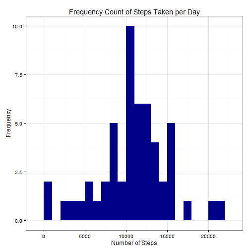
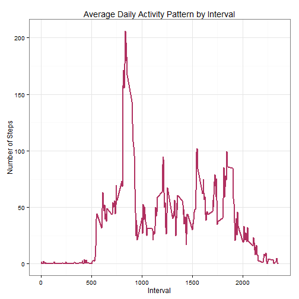
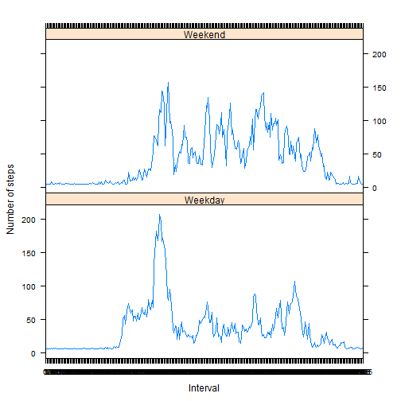

#Introduction

It is now possible to collect a large amount of data about personal movement using activity monitoring devices such as a Fitbit, Nike Fuelband, or Jawbone Up. These type of devices are part of the “quantified self” movement – a group of enthusiasts who take measurements about themselves regularly to improve their health, to find patterns in their behavior, or because they are tech geeks. But these data remain under-utilized both because the raw data are hard to obtain and there is a lack of statistical methods and software for processing and interpreting the data.

This assignment makes use of data from a personal activity monitoring device. This device collects data at 5 minute intervals through out the day. The data consists of two months of data from an anonymous individual collected during the months of October and November, 2012 and include the number of steps taken in 5 minute intervals each day.

#Data

The variables included in this dataset are:

**steps**: Number of steps taking in a 5-minute interval (missing values are coded as NA)

**date**: The date on which the measurement was taken in YYYY-MM-DD format

**interval**: Identifier for the 5-minute interval in which measurement was taken

The dataset is stored in a **comma-separated-value (CSV) file** and there are a total of **17,568** observations in this dataset.


##Loading and preprocessing the data
###Load the data


```r
data <- read.csv("C:/Users/Sean/Desktop/Coursera/repdata-data-activity/activity.csv")
```

###Process/transform the datainto a format suitable for analysis

###Convert the date field to Date class  


```r
data$date <- as.Date(data$date, format = "%Y-%m-%d")
```

###Convert the interval field to Factor class.


```r
data$interval <- as.factor(data$interval)
```

##What is the mean total number of steps taken per day?

###Calculate the total number of steps taken per day


```r
total_steps <- aggregate(steps ~ date, data, sum, na.rm=TRUE)
colnames(total_steps) <- c("date","total")
```

###Make a histogram of the *total* number of steps taken each day

 

###Calculate and report the *mean* and *median* of the total number of steps taken per day


```r
mean_steps <- mean(total_steps$total)
```


```r
median_steps <- median(total_steps$total)
```

####The mean is 10766.189 and median is 10765.

##What is the average daily activity pattern?

###Make a time series plot (i.e. type = "l") of the 5-minute interval (x-axis) and the average number of steps taken, averaged across all days (y-axis)

###Compute the means of steps across all days for each interval


```r
mean_interval <- aggregate(steps ~ interval, data, mean, na.rm=TRUE)
```

###Rename the attributes


```r
colnames(mean_interval) <- c("interval", "mean")
```

###Convert to integers 


```r
mean_interval$interval <- as.integer(levels(mean_interval$interval)[mean_interval$interval])
```

###Compute the time series plot

 

###Which five minute interval has the highest mean number of steps?


```r
max_interval <- max(mean_interval)
max_interval <- gsub("23", "11",(as.character(max_interval)))
```

#### The interval 11:55 PM had the highest mean number of steps.

##Imput the missing values
###Calculate and report the total number of missing values in the dataset 


```r
data_na <- sum(is.na(data))
data_na
```

```
## [1] 2304
```

####The total number of rows with missing data is 2304

##Devise a strategy for filling in all of the missing values in the dataset
###Create a new dataset equal to the original dataset but with the missing data filled in


```r
library(Hmisc)
data_fill <- data
data_fill$steps <- with(data_fill, impute(steps, mean))
```

###Calculate and report the mean and median total number of steps taken per day 


```r
total_steps_fill <- tapply(data_fill$steps, data_fill$date, sum)

mean(total_steps$total)
```

```
## [1] 10766.19
```

```r
mean(total_steps_fill)
```

```
## [1] 10766.19
```

```r
median(total_steps$total)
```

```
## [1] 10765
```

```r
median(total_steps_fill)
```

```
## [1] 10766.19
```

####Do these values differ from the estimates from the first part of the assignment? 
The mean total number of steps per day for both the orginal dataset and the filled dataset
was the same: 10766.19.  The median was also almost the same: 10766.19 and 10765, respectively.

####What is the impact of imputing missing data on the estimates of the total daily number of steps?
Filling in the missing values shifted the median slightly so that it is now equal to the mean.  This is because we used the mean values of the corresponding intervals to replace the missing values. If we had chosen to replace the missing values with a different value (for example, zeros) the results would have been skewed (in this case, a lower mean and median values).

###Make a histogram of the total number of steps taken each day

```r
qplot(total_steps_fill, xlab = "Total steps", ylab = "Frequency")
```

 

##Are there differences in activity patterns between weekdays and weekends?

###Create a new factor variable in the dataset with two levels – “weekday” and “weekend” indicating whether a given date is a weekday or weekend day.

###Create a new factor variable two levels– “weekday” and “weekend”


```r
factor_week <- function(date) {
  if(weekdays(as.Date(date)) %in% c("Saturday", "Sunday")) {
    day <- "Weekend"
  } else {
    day <- "Weekday"
  }
}

data_fill$factor_week <- as.factor(sapply(data_fill$date, factor_week))
```

##Make a panel plot containing a time series plot of the 5-minute interval and the average number of steps taken, averaged across all weekday days or weekend days. 

###Dataframe of the mean and median number of steps taken, averaged across all days


```r
library(reshape2)
data_fill_melt <- melt(data_fill, measure.vars="steps")
data_fill_mean <- dcast(data_fill_melt, factor_week+interval~variable, mean)
```

 

####For most intervals of the day, more steps were taken on weekends. The exceptions were: 1) Roughly the same number of steps were taken in the "early morning" intervals (when the subjects were likely asleep) and 2) More steps were taken during the intervals representing "late morning" on weekdays (shown by the spike roughly one-third of the way across the x axis in the figure above).


